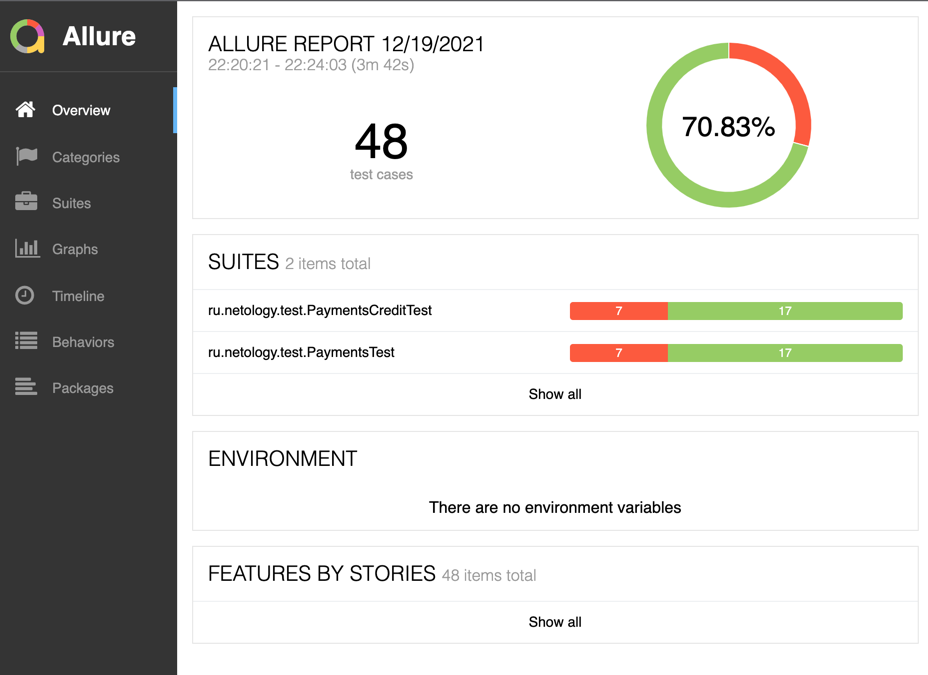

# Отчет по итогам автоматизации

Выполнена автоматизация тестирования веб-сервиса для покупки путешествия по карте либо в кредит:
* реализованы позитивные и негативные сценарии 
* реализована поддержка двух БД - MySQL и PostgreSQL
* правильность сохраняемых в СУБД данных

Количество тестовых сценариев:
* Всего тест-кейсов проверено 48 (в соответствии с планом 24 кейса по каждой форме оплаты), из них:
* Тестирование формы покупки по карте - 21 
* Тестирование формы покупки в кредит - 21
* Тестирование занесения информации в базы данных: 3/3

Процент успешных тестов - 70,83%
Процент неуспешных - 22,17%
___
Обнаружено багов - 8 (7 багов в ходе прогона сценариев и 1 баг орфографическая ошибка в названии)

Отчеты о тестировании были сформированы с помощью инструмента "Allure"

____

Рекомендации:

* Необходимо исправление выявленных багов (см. Issue)
* Необходимо повысить testability приложения путем присвоения уникальных test_id для элементов графического интерфейса
* Заменить предупреждения "Неверный формат" на более понятные пользователю
____
